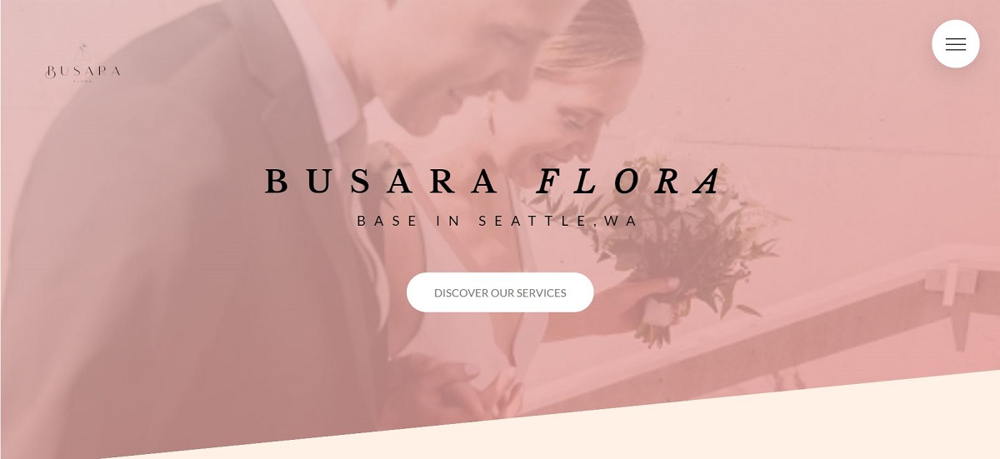

<!-- PROJECT HEADER -->

<h1 align="center">:bouquet: Busara Flora :bouquet:</h1>

  

<!-- ABOUT THE PROJECT -->
## :memo: About The Project

A website for a local florist with a clean design and accessible for all devices. I first created this website 2 years ago as a trial version 
for my cousin who is the flower shop owner. Her clients are mostly online base, so I think it must be nice to create a website that can showcase 
all her work and services.

This project means a lot to me as it's the very first website that I've created. I've linked the first version of this website below, 
so you can see the improvement and effort I have put into it. I've learned a lot of codings in the past few years, but my passion is with web development. Hope you guys like it and please feel free to give me feedback for my future improvement.:relaxed:

<a href="https://jmjusmin.github.io/busaraFloraV2">View Demo (V.2.0)</a>&emsp;<a href="https://jmjusmin.github.io/busaraFlora">View Demo (V.1.0)</a>

(<a href="#readme-top">back to top</a>)

<!-- Technologies use -->
## :wrench: Built With

* [![Sass-lang.com]][Sass-url]
* [![Bootstrap][Bootstrap.com]][Bootstrap-url]

(<a href="#readme-top">back to top</a>)

<!-- Future -->
## :rocket: Future development
* Convert all the code to React
* Making a build-in booking system

(<a href="#readme-top">back to top</a>)

<!-- CONTACT -->
## :love_letter: Contact me

Email: - jpratheeppornsak@gmail.com

Project Link: [https://jmjusmin.github.io/busaraFloraV2/](https://jmjusmin.github.io/busaraFloraV2/)

(<a href="#readme-top">back to top</a>)

<!-- MARKDOWN LINKS & IMAGES -->
<!-- https://www.markdownguide.org/basic-syntax/#reference-style-links -->
[linkedin-shield]: https://img.shields.io/badge/-LinkedIn-black.svg?style=for-the-badge&logo=linkedin&colorB=555
[linkedin-url]: https://linkedin.com/in/linkedin_username
[product-screenshot]: images/screenshot.png
[Bootstrap.com]: https://img.shields.io/badge/Bootstrap-563D7C?style=for-the-badge&logo=bootstrap&logoColor=white
[Bootstrap-url]: https://getbootstrap.com
[Sass-lang.com]: https://img.shields.io/badge/SASS-cc6699?style=for-the-badge&logo=sass&logoColor=white
[Sass-url]: https://sass-lang.com
